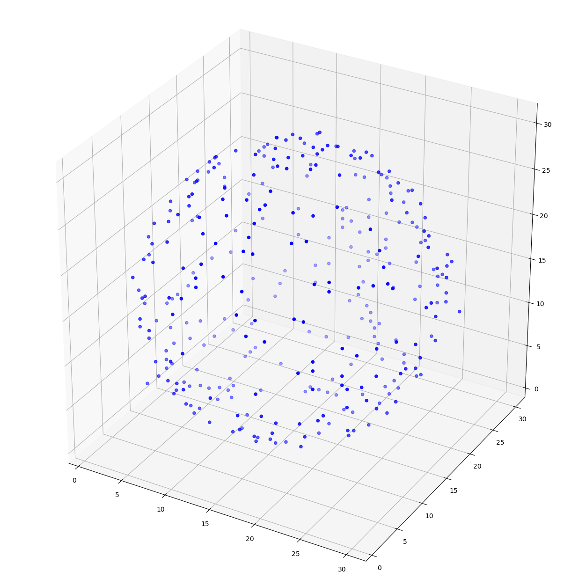
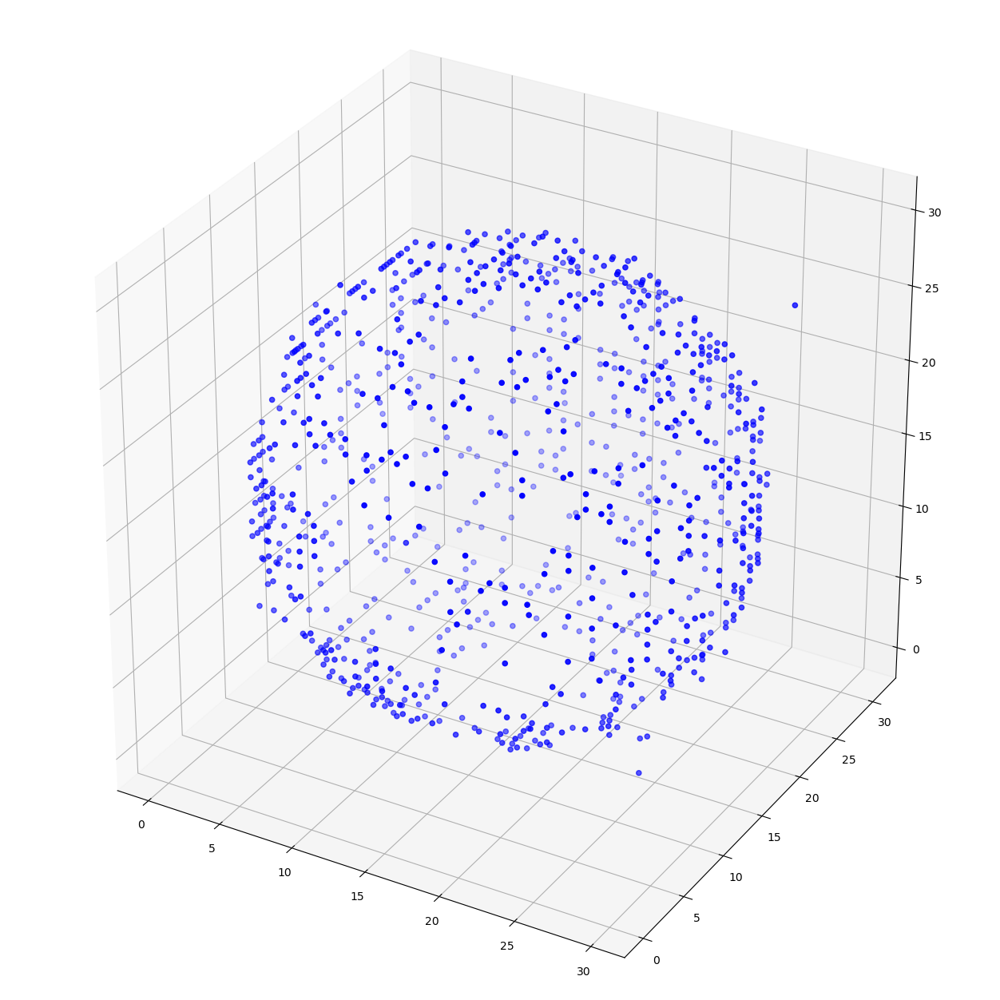
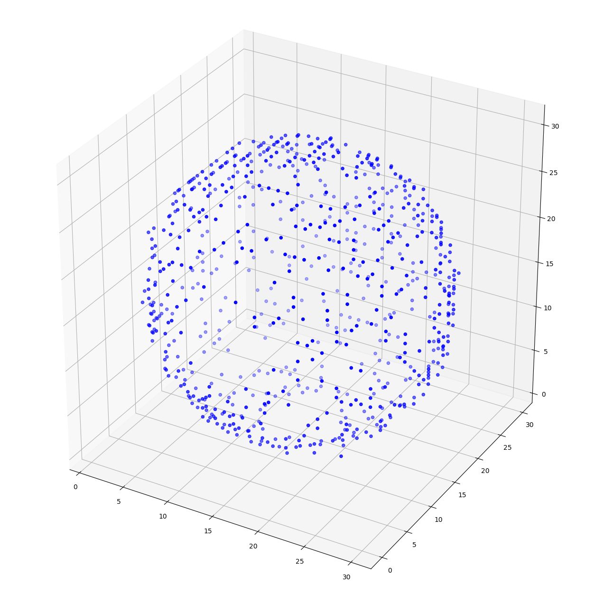

# 3D-GAN for Shape Generation

## Introduction
* Aim: Create a dataset of 3D shapes (spheres) and train a neural network to generate them.
* Generative Architecture: 3DCNN based on the paper: [https://arxiv.org/abs/1610.07584](https://arxiv.org/abs/1610.07584); done using the pytorch implementation

## Generating Dataset
The dataset was made by randomly generating point clouds of spheres. The code/procedure for the dataset generation can be found in ```shape_procedure/generate3dShapes.ipynb```. Two sample datasets with 1000 spheres are provided: point clouds with 500 points and with 1000 points (found in ```shape_data/sphere```).

## Training Model
Note: dataset and output path should be changed accordingly in ```model/constants.py```
* In the terminal, run `cd model` and then:
```python
python main.py
```
* The model will be trained for 300 epochs and a batch size of 32. To change the specifications, run:
```python
python main.py --epochs=[EPOCH] --batch_size=[BATCH_SIZE]
```
with replaced values for [EPOCH] and [BATCH_SIZE].
* Trained model and images of generated spheres will be outputed in a separate data file (example output found in ```data/generated```).

## Pre-trained Model
* Pretrained generator and discriminators are found in ```data/generated/models```
* To use pretrained model, run `cd model` and then:
```
python main.py --pretrained=true
```
* Specific are found in ```model/generate.py```

## Results
This is an example sphere generated for a sphere with 500 points:



This is an example sphere generated for a sphere with 1000 points:



This is an example sphere generated for a sphere with 1000 points (after 500 epochs):



## Future Directions
* Adaptation for different geometric shapes and even more random shapes like biological structures
* Generation of shapes with different sizes in the dataset

## References
* Pytorch implemenation based on the repo: [3DGAN-Pytorch](https://github.com/rimchang/3DGAN-Pytorch/tree/master)
* Pytorch usage reference: [DCGAN Pytorch](https://pytorch.org/tutorials/beginner/dcgan_faces_tutorial.html)


